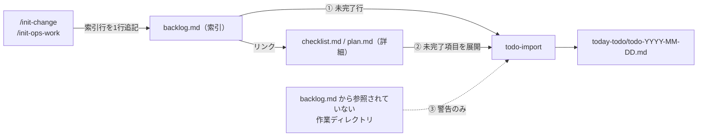

# todo マネジメント仕様（全体像と責務分担）

対象: `$HOME/projects/` 配下のタスク管理ファイル（`backlog.md`・change の `checklist.md`・ops の `plan.md`・`today-todo/`）
位置づけ: 各ファイルの役割と、情報が流れる方向を決める上位仕様。行の書式や抽出手順などの細部は
「5. 詳細仕様の所在」に挙げたファイルに任せ、本ファイルとそれらが矛盾した場合は本ファイルを正とする。
決定の経緯: [`changes/0011-20260929-todo-management/proposal.md`](./changes/0011-20260929-todo-management/proposal.md)

---

## 1. 原則: backlog.md は索引、詳細は作業ディレクトリが持つ

| ファイル | 役割 | 書くもの | 書かないもの |
|---|---|---|---|
| `<sub>/docs/tasks/backlog.md` | **索引**。今日のタスクに出すかどうかと優先度を人が管理する | 作業ディレクトリ1件につき1行（リンク付き）。経緯・判断メモ | 作業ディレクトリ内の進み具合（「次: 〜」など） |
| `<sub>/docs/changes/<dir>/checklist.md`（dev） | **詳細の唯一の情報源** | その change の作業項目 `- [ ]`/`- [x]` | — |
| `<sub>/order-yyyymmdd/plan.md`（ops） | 同上（ops 版） | その依頼の作業項目 | — |
| `today-todo/todo-YYYY-MM-DD.md` | 上の2つを横断して写したもの。ここから情報を生み出さない | todo-import の出力と、ユーザーの手書き注記 | — |

- 1件の作業について、同じ進み具合を2か所に書かない。
- backlog.md に `- [ ]` の行が無い作業ディレクトリは、today-todo に出さない（警告の対象になる）。

## 2. 情報の流れ



## 3. ライフサイクル

```mermaid
flowchart TD
  S["作業中<br>（today-todo の展開項目から着手）"] -->|項目が終わった| D0["checklist.md の項目を - [x]"]
  S -->|作業中いつでも:<br>新しい作業が見つかった| Q2{この change の範囲内?}
  Q2 -->|Yes| A1["checklist.md に - [ ] を追記<br>（backlog.md は変更しない）"]
  Q2 -->|No| A2["/init-change で別の change を作成<br>→ backlog.md に新しい索引行"]
  A1 --> S
  A2 --> S
  D0 --> Q3{checklist.md に - [ ] が残っている?}
  Q3 -->|Yes| S
  Q3 -.->|今日はここまで| A3["次回の todo-import が<br>残りを展開"]
  Q3 -->|No| A4["backlog.md の索引行を - [x] → /archive"]
```

| 契機 | 更新するファイル | 担当 |
|---|---|---|
| 作業ディレクトリを作る | backlog.md に索引行を追記 | `/init-change`・`/init-ops-work`・`/todo-propose` |
| 作業項目の完了・追加 | checklist.md（ops は plan.md）だけ | 作業者 |
| 作業ディレクトリ内が全部完了した | backlog.md の索引行を `- [x]` にする | 作業者・`/archive` |
| 進み具合を today-todo に反映する | today-todo（差分反映） | `/todo-import` の再実行 |

## 4. todo-import の読み取り規則

1. `projects/*/docs/tasks/backlog.md` の `- [ ]` 行を列挙する。
2. 行のリンクが `docs/changes/<dir>/` を指していれば、同じディレクトリの `checklist.md` にある
   `- [ ]` を、その行の子として展開する。
   ops（`order-yyyymmdd/`）の場合は `plan.md` の `- [ ]` を同じように展開する。
3. 次の2つを警告として出力の末尾に載せる。
   - リンク先が存在しない行
   - backlog.md から参照されていない `docs/changes/<dir>/`（`archives/` は除く）

## 5. delta spec は checklist.md に書かず、仕組みが担う

checklist.md には delta spec（`docs/changes/<dir>/specs/`）の手順を書かない。各手順の担当は次のとおり。

| 手順 | 担当 | 人がやること |
|---|---|---|
| 着手時の変更予定の記入 | 行わない（予定は proposal.md・design.md が持つ） | なし |
| spec 編集の直前に `specs/base/` へコピー | PreToolUse hook（`docs/specs/**` への Edit/Write を検知）。アーカイブ前の change が複数あるときはブロックして指定させる | 複数あるときの指定のみ |
| diff の生成、README の確定、base/ の削除、変更理由の記入 | `/archive` が完了チェックの前に実行する。変更理由は diff と proposal.md から埋める | なし |
| 保証索引 | `/archive` が下書きを作る。diff で追加・変更された受け入れ条件を「新規」、diff の範囲にあって変更されていない条件を「維持」とし、`tests/` を AC ID で grep してテスト列を埋める。AC ID が無いプロジェクトでは AI がテストを読んで下書きし、確信度が低い行は Gaps に回す | 下書きの確認 |
| Gaps | `/archive` がテストの見つからない条件を列挙する。0件なら「なし」と書く | 各行の理由の記入。空欄なら `/archive` が止まる |

- 保証索引とGapsの処理は、specs/README.md に「保証索引」節がある change にだけ適用する。
  節の無い change（仕組みの導入前に作ったもの）や README の無い change は止めず、`/archive` の報告に
  「旧形式: 保証索引なし」と1行出すだけにする。節を後から自動で足すこともしない。
- 受け入れ条件には AC ID（例: `AC16`）を振り、それを検証するテストの名前かコメントに同じ ID を含める。

## 6. 詳細仕様の所在

| 範囲 | ファイル | 本仕様との関係 |
|---|---|---|
| backlog.md の1行の書式 | `$HOME/.claude/skills/todo-format/SKILL.md` | 「補足（進捗メモ）は次行以降に字下げして書いてよい」は、1章の「進み具合を書かない」に従い、経緯・判断メモに限る |
| todo-import の抽出・出力 | `self-work/today-todo/docs/specs/spec.md` | 4章の2・3（checklist.md の展開と警告）は未反映 |
| 横断表示（読み取り専用） | `self-work/check-todos/SPEC.md` | backlog.md だけを見る。展開はしない |
| 更新漏れの警告フック | `self-work/todo-sync-hook/SPEC.md` | backlog.md・checklist.md のどちらかを更新していれば OK とする粗い安全網のまま |
| today-todo 配下のファイルと更新ペア原則 | [`document-rules.md`](./document-rules.md) | 更新ペア原則の「正の情報源」は、1章の索引＋詳細の2つを指す |
